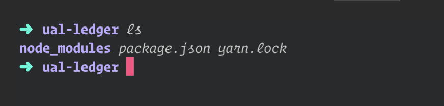
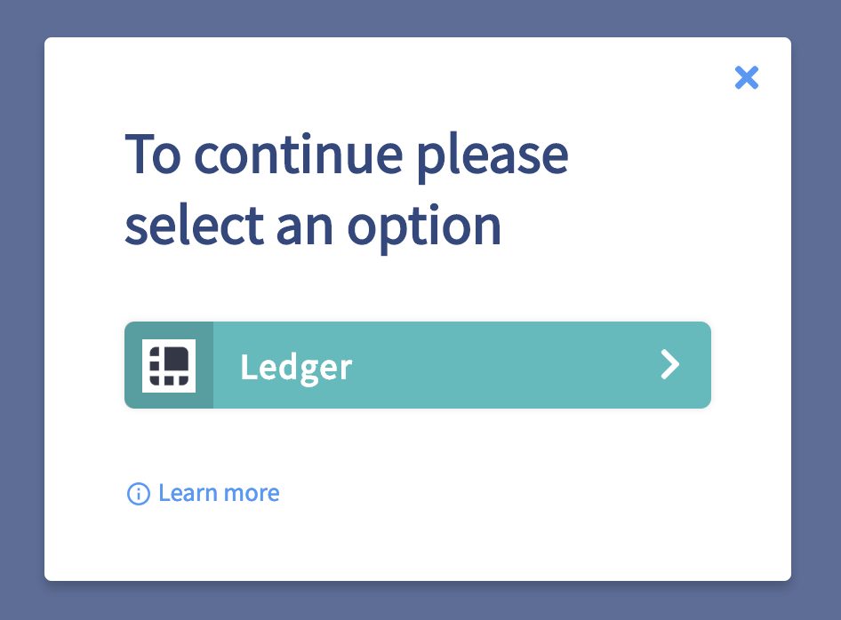

# UAL New Authenticator Walkthrough 🔐

This tutorial walks through the steps required to create a [UAL](https://github.com/EOSIO/universal-authenticator-library/tree/develop/packages/universal-authenticator-library) for Ledger [Authenticator](https://github.com/EOSIO/universal-authenticator-library/blob/develop/packages/universal-authenticator-library/src/Authenticator.ts). 


# About EOSIO Labs

EOSIO Labs repositories are experimental.  Developers in the community are encouraged to use EOSIO Labs repositories as the basis for code and concepts to incorporate into their applications. Community members are also welcome to contribute and further develop these repositories. Since these repositories are not supported by Block.one, we may not provide responses to issue reports, pull requests, updates to functionality, or other requests from the community, and we encourage the community to take responsibility for these.

## Overview

The Universal Authenticator Library creates a single universal API which allows app developers to integrate ***multiple*** signature providers with just a few lines of code. This is done through custom `Authenticators`.

An `Authenticator` represents the bridge between [UAL](https://github.com/EOSIO/universal-authenticator-library/tree/develop/packages/universal-authenticator-library) and a custom signing method.

A developer that wishes to add support for their signature provider to UAL must create an `Authenticator` by implementing 2 classes. An `Authenticator` and a `User`.

The `Authenticator` class represents the business logic behind the renderer, handles login/logout functionality and initializes the `User` class.

Logging in returns 1 or more User objects. A `User` object provides the ability for an app developer to request the app `User` sign a transaction using whichever authenticator they selected when logging in.

In this tutorial I'll walk through the steps of implementing a custom `UAL Authenticator`, we'll be creating a [ual-ledger](https://github.com/EOSIO/ual-ledger) Authenticator. I'll try to explain some of the implementation specific details for `ual-ledger` and show examples of other UAL Authenticators.

Each step in this tutorial has a correlating branch on github labeled `step-1`, `step-2`, etc. Each step assumes you are starting at the correlating branch.

At the end we'll test the custom Authenticator with an example app found in [example/app](./example/app).

## Getting Started

## **Step 1**: Project setup 


```bash
~ git clone git@github.com:EOSIO/ual-authenticator-walkthrough.git
~ cd ual-authenticator-walkthrough/examples/authenticator
~ yarn
```

At this point you should have a basic folder structure that looks like this.




## **Step 2**: Creating the abstract `Authenticator` and `User` classes

Create a new class `Ledger` in `src/Ledger.js` thats extends from the `Authenticator` class and add empty functions for all the abstract methods.

Next we'll do the same thing for the `LedgerUser` in `src/LedgerUser.js` that extends from the `User` class.

 Export both files from `src/index.js` with the contents below.

```javascript
export * from './Ledger'
export * from './LedgerUser'
```

#### View the completed [Ledger.js](https://github.com/EOSIO/ual-authenticator-walkthrough/blob/step-2/example/authenticator/src/Ledger.js)
#### View the completed  [LedgerUser.js](https://github.com/EOSIO/ual-authenticator-walkthrough/blob/step-2/example/authenticator/src/LedgerUser.js)


## **Step 3**: Implementing the `Authenticator` class

The internal business logic of each Authenticator method will depend on the signing method you are using. The only limitations are the input/return types must match the abstract method it is implementing. 

Although not all methods may be necessary for your `Authenticator`, you're required to implement ***all*** abstract methods from the base [Authenticator](https://github.com/EOSIO/universal-authenticator-library/blob/develop/packages/universal-authenticator-library/src/Authenticator.ts) class.

The key methods here are `init, getStyle, login, logout`.

1. **`init()`** - Should be used to handle any async operations required to initialize the authenticator. `isLoading()` should return true until all async operations in `init` are complete and the authenticator is ready to accept login/logout requests.
2. **`getStyle()`** - Gives you the ability to customize your `Authenticator` and how it is displayed to app users. 
    ```javascript
    getStyle() {
      return {
        // An icon displayed to app users when selecting their authentication method 
        icon: './custom-icon.png',
        // Name displayed to app users
        text: 'Ledger',
        // Background color displayed to app users who select your authenticator
        background: '#44bdbd',
        // Color of text used on top the `backgound` property above
        textColor: '#FFFFFF',
      }
    }
   ```
3. **`login()`** - The implementation depends entirely on the signing method you are using, whether it supports multiple chains, and the communication protocol used. You'll need to create a new `User` class, verify the keys match the account provided, add the `User` to an array, and return the array of `User`'s. Otherwise throw an error with the appropriate messaging, this error will be displayed to the app user.

    **Here are variations of `login()` with a brief description of the different approaches.**

   * [ual-ledger](https://github.com/EOSIO/ual-ledger/blob/develop/src/Ledger.ts#L48) - Ledger requires an `accountName` and calls `requiresGetKeyConfirmation` to determine if the app user has already confirmed the public key from their ledger device, if so they won't need to give permission again. By calling `LedgerUser.isAccountValid()` the authenticator utilizes the  [eosjs-ledger-signature-provider](https://github.com/EOSIO/private-eosjs-ledger-signature-provider) and communicates with the ledger device through the `U2F` protocol.
      ```javascript
      async login(accountName) {
        for (const chain of this.chains) {
          const user = new LedgerUser(chain, accountName, this.requiresGetKeyConfirmation(accountName))
          await user.init()
          const isValid = await user.isAccountValid()
          if (!isValid) {
            const message = `Error logging into account "${accountName}"`
            const type = UALErrorType.Login
            const cause = null
            throw new UALLedgerError(message, type, cause)
          }
          this.users.push(user)
        }

        return this.users
      }
      ```

    * [ual-scatter](https://github.com/EOSIO/ual-scatter/blob/develop/src/Scatter.ts#L91) - Scatter does not require an `accountName` parameter and uses the [Scatter-JS](https://github.com/GetScatter/scatter-js) library to communicate with [Scatter Desktop](https://get-scatter.com/).
        ```javascript
        async login() {
          try {
            for (const chain of this.chains) {
              const user = new ScatterUser(chain, this.scatter)
              await user.getKeys()
              this.users.push(user)
            }

            return this.users
          } catch (e) {
            throw new UALScatterError(
              'Unable to login',
              UALErrorType.Login,
              e)
          }
        }
        ```
    * [ual-lynx](https://github.com/EOSIO/ual-lynx/blob/develop/src/Lynx.ts#L102) - Lynx injects a `lynxMobile` object into the browsers global window object, by accessing `lynxMobile` we can call `requestSetAccount` and receive an object containing the account information of the account logged into the Lynx Wallet. 

      ```javascript
      async login() {
        if (this.users.length === 0) {
          try {
            const account = await window.lynxMobile.requestSetAccount()
            this.users.push(new LynxUser(this.chains[0], account))
          } catch (e) {
            throw new UALLynxError(
              'Unable to get the current account during login',
              UALErrorType.Login,
              e)
          }
        }

        return this.users
      }
      ```

4. **`logout()`** - Responsible for terminating connections to external signing methods, if any exist, and deleting user information that may have been cached in the `User` or `Authenticator` classes.

    **Variations of `logout()`**

    * [ual-ledger](https://github.com/EOSIO/ual-ledger/blob/develop/src/Ledger.ts#L65) - The [eosjs-ledger-signature-provider](https://github.com/EOSIO/private-eosjs-ledger-signature-provider) performs a simple caching of public keys that need to be cleared on logout. We accomplish this by calling `signatureProvider.clearCachedKeys()` and remove the logged in users by reassigning `this.users` to an empty array.

      ```javascript
      async logout() {
        try {
          for (const user of this.users) {
            user.signatureProvider.cleanUp()
            user.signatureProvider.clearCachedKeys()
          }
          this.users = []
        } catch (e) {
          const message = CONSTANTS.logoutMessage
          const type = UALErrorType.Logout
          const cause = e
          throw new UALLedgerError(message, type, cause)
        }
      }
      ```

    * [ual-scatter](https://github.com/EOSIO/ual-scatter/blob/develop/src/Scatter.ts#L108) - Calling `this.scatter.logout()` removes the `Identity` from scatter utilizing scatters built in method for logging out.
      ```javascript
      async logout() {
        try {
          this.scatter.logout()
        } catch (error) {
          throw new UALScatterError('Error occurred during logout',
            UALErrorType.Logout,
            error)
        }
      }
      ```
    * [ual-lynx](https://github.com/EOSIO/ual-scatter/blob/develop/src/Scatter.ts#L108) - Since lynx does not provide a method of logging out we simple reassign `this.users` to an empty array.

        ```javascript
        async logout() {
          this.users = []
        }
        ```
#### View the completed [Ledger.js](https://github.com/EOSIO/ual-authenticator-walkthrough/blob/step-4/example/authenticator/src/Ledger.js)


## **Step 4**: Implementing the `User` class

You are required to implement all abstract methods from the base [User](https://github.com/EOSIO/universal-authenticator-library/blob/develop/packages/universal-authenticator-library/src/User.ts) class.

The main methods to be implemented here are `getKeys, signTransaction, signArbitrary`.

  1.  **`getKeys()`**  - Calling this method should return an array of public keys 🔑. How the authenticator gets those keys depends on the signing method you are using and what protocol it uses. For example, `ual-ledger` uses the [eosjs-ledger-signature-provider](https://github.com/EOSIO/private-eosjs-ledger-signature-provider) to communicate with the Ledger device through the U2F protocol and `ual-scatter` simply returns the keys it has already received from the inital call to `scatter.getIdentity`.

      **Here are variations of `getKeys()`**
      * `ual-ledger`
        ```javascript
        async getKeys() {
          try {
            const keys = await this.signatureProvider.getAvailableKeys(this.requestPermission)
            return keys
          } catch (error) {
            const message = `Unable to getKeys for account ${this.accountName}.
              Please make sure your ledger device is connected and unlocked`
            const type = UALErrorType.DataRequest
            const cause = error
            throw new UALLedgerError(message, type, cause)
          }
        }
        ```
      * `ual-scatter`
        ```javascript
        async getKeys() {
          if (!this.keys || this.keys.length === 0) {
            // `refreshIdentity` calls `scatter.getIdentity` then
            // sets the `keys` and `accountName` properties on the 
            // `User` class
            await this.refreshIdentity()
          }

          return this.keys
        }
        ```

  2. **`signTransaction(transaction, config)`** - Exposes the same API as `Api.transact` in [eosjs](https://github.com/EOSIO/eosjs/blob/develop/src/eosjs-api.ts).

  3. **`signArbitrary(publicKey, data, helpText)`** - A utility function to sign arbitrary data. If your authenticator does not support this type of signing you can simple return an error with the correct message.

      **Example of an authenticator that does not support `signArbitrary`**
      ```javascript
      // LedgerUser.js

      async signArbitrary() {
        throw new UALLedgerError(
          `${Name} does not currently support signArbitrary`,
          UALErrorType.Unsupported,
          null,
        )
      }
      ```

#### View the completed [LedgerUser.js](https://github.com/EOSIO/ual-authenticator-walkthrough/blob/step-5/example/authenticator/src/LedgerUser.js)

## **Step 5**: Test your Authenticator 🔑🔓
Now that we've implemented all the abstract methods on our `Ledger` and `LedgerUser` classes lets test them in the example react app provided in [examples](./examples/app).

Go to [examples](./examples/app) and follow the instructions.

 

*All product and company names are trademarks™ or registered® trademarks of their respective holders. Use of them does not imply any affiliation with or endorsement by them.*

## Contribution
Check out the [Contributing](./CONTRIBUTING.md) guide and please adhere to the [Code of Conduct](./CONTRIBUTING.md#Conduct)

## License
[MIT licensed](./LICENSE)

## Important

See LICENSE for copyright and license terms.  Block.one makes its contribution on a voluntary basis as a member of the EOSIO community and is not responsible for ensuring the overall performance of the software or any related applications.  We make no representation, warranty, guarantee or undertaking in respect of the software or any related documentation, whether expressed or implied, including but not limited to the warranties or merchantability, fitness for a particular purpose and noninfringement. In no event shall we be liable for any claim, damages or other liability, whether in an action of contract, tort or otherwise, arising from, out of or in connection with the software or documentation or the use or other dealings in the software or documentation.  Any test results or performance figures are indicative and will not reflect performance under all conditions.  Any reference to any third party or third-party product, service or other resource is not an endorsement or recommendation by Block.one.  We are not responsible, and disclaim any and all responsibility and liability, for your use of or reliance on any of these resources. Third-party resources may be updated, changed or terminated at any time, so the information here may be out of date or inaccurate.
